# Socially Aware Robot Navigation (AIxHRI Summer School 2026)

For a robot navigating in human environments, the classical navigation strategies do not work well. In this tutorial, we will implement simple socially aware robot navigation in Nav2 using an MPPI planner (in Simulation) and explore the use of a mature CoHAN planner (in Simulation and on the Shelfy robot). The tutorial is divided into following three parts:

**Part A**: Nav2 basics to build map and navigate.   
**Part B**: Build your own socially aware robot navigation controller using MPPI.  
**Part C**: Using CoHAN and understanding its parameters for socially aware navigation with Demo on Shelfy.  

## Part A - Nav2 Basics
Before jumping into the socially aware robot navigation part, we will understand how to use the existing Nav2 stack in ROS2. Nav2 provides several components required for navigation openly for the community to use. In general, navigation requires a map of the environment, localization of the robot in this environment, and then comes the path planning and control. The goals for this part of the tutorial are the following:

1. Build a map of a simple simulated environment using Nav2's SLAM toolbox.
2. Understanding different components and their basic configurations for using built-in Nav2 planners and controllers.
3. Navigate the robot in simulation using a DWA controller.


### Part 1: Build the map. 

- Open a Docker shell (cd Tutorial_09_Social_Robot_Navigation and ./run-docker.sh)
    ```
    cd Tutorial_09_Social_Robot_Navigation
    ./run-docker.sh
    ```

- Run the following inside the shell
    ```
    cd socnav_ws/Nav2
    ros2 launch launch/slam_launch.py
    ```

You should see the simulator and Rviz pop up without any map.  
**To Move Robot**: Click on the simulator and use keys 'i', 'j', 'k', 'l' to move it forward, left, back and right repectively. To rotate, use 'a' and 'd'.
- Start moving the robot in the simulator. 
- You should see the building of the map slowly. 
- Move around the entire environment and complete the map. 

    

- Finally, save the completed map using the following command in another Docker shell
    ```
    ros2 run nav2_map_server map_saver_cli -f ~/socnav_ws/Nav2/maps/map
    ```

### Part 2: Understand the configs.  
- Open the file [nav2_config.yaml](./ros2_ws/Nav2/launch/nav2_config.yaml)

- The map server, amcl (localization), planner server, behavior server, and bt_navigator are the standard ones from Nav2 for this tutorial. 
- Although we will use standard global and local costmaps configs initially, we will make some changes in Part B and Part C. 
- Major changes will happen in the controller server as we will be changing this completely for the next parts.
- You will see **plugin: "dwb_core::DWBLocalPlanner"** in the controller part. You will have to change this part and the parameters following this to use a different controller.


### Part 3: Navigate in Simulation.
- Now let's navigate the robot autonomously in the simulation using the map built previously. In your Docker shell, do the following
    ```
    cd socnav_ws/Nav2
    ros2 launch launch/nav2_launch.py
    ```
- Set navigation goal using 2D Goal Pose tool in Rviz and see the robot moving autonomously!! 

    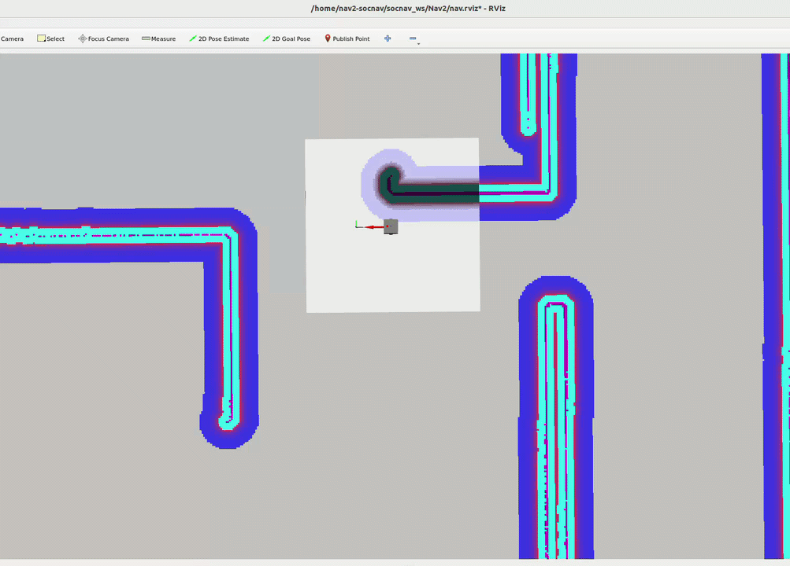


## Part B - Socially Aware Robot Navigation with MPPI

We will use a custom simulator for this part of the tutorial. We will start by adding humans to the simulation. 
- For this step, open the [world.yaml](./ros2_ws/MPPI/src/socnav_tutorial/worlds/world.yaml) in ros2_ws/MPPI/src/socnav_tutorial/worlds and add two human agents. Check this [page](https://cohan-nav2.readthedocs.io/cohan_sim.html) for more details.

Model Predictive Path Integral (MPPI) controller combines the ideas of model predictive control and trajectory rollouts into one. The framework rolls out (or simulates) a lot of trajectories using the given control model of the robot. These trajectories are obtained by perturbing around a nominal control sequence. Costs for tracking, obstacle avoidance, etc., are defined and the cost for each rollout and are stored. Finally, you take the weighted average of all or some (min cost) trajectories to obtain the final trajectory. Like MPC, the first control is executed, and the computation is repeated for the next control cycle (receding horizon).   

We are now ready to build our own MPPI controller. You are given a basic version of the planner that moves the robot along the given path without any consideration for obstacles. If the path is good, the robot moves well. If a human appears, it will collide (in the simulation, it passes through) with the human. It might also fail in turning corners. The goals for this part of the tutorial are the following:  

1. Build, launch, and test the basic version of MPPI to see how it behaves.
2. Introduce costmap avoidance into MPPI so that the robot can avoid obstacles and static humans well.
3. Introduce human prediction and human avoidance so that MPPI can avoid moving humans proactively. 

### Part 1: Build and Test the basic MPPI

A basic version of MPPI with just tracking cost is implemented and given to you. We will test it before continuing to the next part.

- To build the basic MPPI, we will use the Docker shell again. Run the following in your shell to build
    ```
    cd socnav_ws/MPPI
    ./compile           ## Alternatively, you can use colcon build
    ```
- To run the navigation with MPPI, run the following version after the building is complete 
    ```
    source install/setup.bash
    ros2 launch socnav_tutorial mppi_nav2_launch.py
    ```
- A separate visualization has to be run to see the robot and humans before you run the navigation. In a separate terminal, run the following
    ```
    cd Tutorial_09_Social_Robot_Navigation
    docker compose up
    ```
    **NOTE: Keep this visualization running. You do not have to kill it.**
- Now move the robot around by giving a goal pose to navigate. See that it passes very close to the wall at turnings and passes through humans!
    
    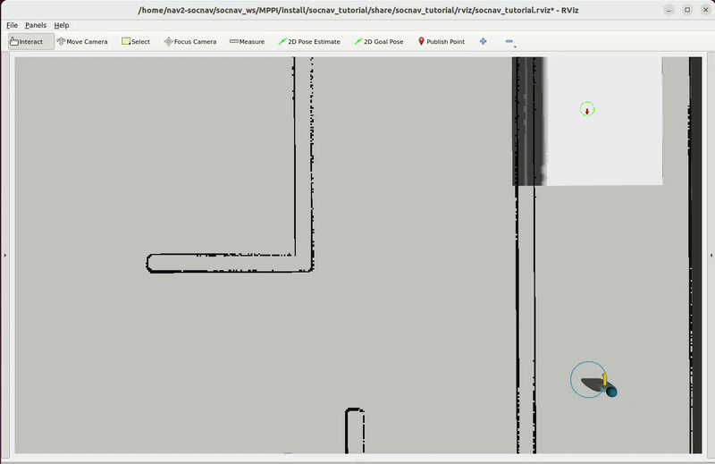

### Part 2: Introduce costmap avoidance into MPPI

Now we will introduce the obstacle avoidance through costmap. Nav2 provides various forms of costmaps that increase the cost of the areas to be avoided. By simply reading the values from the costmap, we can avoid the obstacles. The idea here is to check if a trajectory falls into the costmap and add this associated extra cost to the trajectory. After this addition, if you select the top low-cost trajectories, they should always avoid the obstacles.

As costmaps are discrete grid data and we often need to query values at continuous coordinates $(x, y)$ that do not land exactly on an integer grid intersection, we perform *bilinear interpolation* on the grid values to prevent "grid-snapping" artifacts. **Bilinear interpolation** is a 2D resampling technique that estimates the unknown value $f(x, y)$ at a continuous point by performing linear interpolations natively across a $2 \times 2$ neighborhood of known grid points.


- #### Step 1: Identify the 4 Surrounding Grid Neighbors
    Given continuous coordinates $(x, y)$, calculate the integer boundary indices:
    * $x_0 = \lfloor x \rfloor$, $x_1 = x_0 + 1$
    * $y_0 = \lfloor y \rfloor$, $y_1 = y_0 + 1$

    Retrieve the 4 cell values from your grid:
    * Bottom-Left ($Q_{00}$) = $\text{grid}[y_0, x_0]$
    * Bottom-Right ($Q_{10}$) = $\text{grid}[y_0, x_1]$
    * Top-Left ($Q_{01}$) = $\text{grid}[y_1, x_0]$
    * Top-Right ($Q_{11}$) = $\text{grid}[y_1, x_1]$

 - #### Step 2: Calculate Fractional Distances (Weights)
    Compute the continuous point's relative offsets inside the target cell unit square (where $dx, dy \in [0, 1)$):
    $$dx = x - x_0$$
    $$dy = y - y_0$$

- #### Step 3: Compute the Interpolation Equation
    Execute the final value blend using a single unified formula:

    $$f(x, y) = (1-dx)(1-dy)Q_{00} + dx(1-dy)Q_{10} + (1-dx)dyQ_{01} + dx\,dy\,Q_{11}$$

- #### Now we will work on the code.
    - Open the file [mppi.py](./ros2_ws/MPPI/src/socnav_controller/socnav_controller/mppi.py) (at ros2_ws/MPPI/src/socnav_controller/socnav_controller/mppi.py) in your favourite editor.  

    - Completed the parts indicated as **Part 1** inside this mppi.py file. 
    - Save the file, compile again, and run the controller in a Docker shell,
        ```
        cd socnav_ws/MPPI
        ./compile 
        source install/setup.bash
        ros2 launch socnav_tutorial mppi_nav2_launch.py
        ```
    - If you are successful, the robot should do this,  
        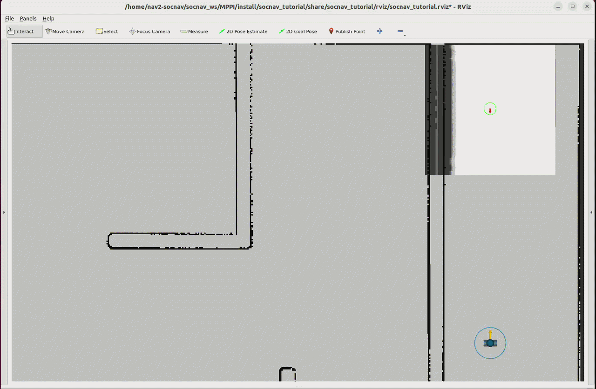

### Part 3: Introduce human prediction and human avoidance

To avoid humans, there are a couple of steps. In this tutorial, we will assume that we have perfect perception and tracking and we know where the humans are and how they are moving. In the real-world this is a challenge, but there are advanced systems that can give this information in real-time nowadays. The humans are already being published on the '*/tracked_agents*' topic and your mppi.py is already subcribed to it. However, it does not use this information yet. Therefore, the first thing in this part is to update the callback for '*/tracked_agents*' and implement a simple constant velocity prediction for the moving humans. These are marked as **Part 2** in your code. The horizon for this prediction should be the same as the robot's horizon so that each sample is associated with the same time-step.

Next, we need to implement the cost for violating the human proxemics or collinding. The proxemics distance for humans to be comfortable is around $1.0\text{m}$ to $1.2\text{m}$ for crossing, and we will use this to define our proxemics distance in our code. For computing the human avoidance cost, do the following for each step:


- **Get Effective Distance**: Subtract the physical bounding radii of both the robot and the human from the Euclidean distances between their centres:

$$\text{dist}_{\text{effective}} = \text{dist} - (\text{R}_{\text{human}} + \text{R}_{\text{robot}})$$

- **Collision Risk Check**: If $\text{dist}_{\text{effective}} < 0$, there will a collision, assign a very high value to avoid this.

- **Proxemics Violation**: If $0 \le \text{dist}_{\text{effective}} < \text{dist}_{\text{proxemics}}$ ($\sim 1.0\text{ to }1.2\text{m}$), the robot has compromised the human's immediate comfort zone. Assign a high-weight penalty that grows sharply as clearance shrinks:

$$\text{cost}_{\text{prox}} \propto \frac{1}{ \text{dist}_{\text{effective}}} \times \text{W}_{\text{high}}$$

- **Safe-Distance**: If $\text{dist}_{\text{effective}} > \text{dist}_{\text{proxemics}}$, apply a nominal gradient cost using a lower weight multiplier. This gently guides path optimizers away from skirting the boundaries of social comfort:

$$\text{cost}_{\text{safe}} \propto \frac{1}{ \text{dist}_{\text{effective}}} \times \text{W}_{\text{low}}$$


- #### Now we will work on the code.

    - We will continue working in [mppi.py](./ros2_ws/MPPI/src/socnav_controller/socnav_controller/mppi.py). 
    - Start working on the parts of the code indicated as **Part 2** inside this file.
    - Once completed, edit the launch file [mppi_nav2_launch.py](./ros2_ws/MPPI/src/socnav_tutorial/launch/mppi_nav2_launch.py) to uncomment the teleop keyboard for humans so that you can move them around.
    - Save everything, compile, source, and launch like above
        ```
        cd socnav_ws/MPPI
        ./compile 
        source install/setup.bash
        ros2 launch socnav_tutorial mppi_nav2_launch.py
        ```
- If everything is good, you should see the robot avoiding the moving human (use the teleop keyboard to move) well in advance.

    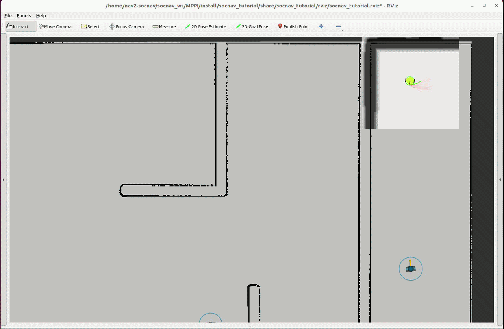
    


## Part C - Introduction of CoHAN and Usage
CoHAN is an advanced socially aware robot navigation planner that combinely plans for the humans and the robot together to find a feasible trajectory for the robot. It includes many ways to improving human-awareness through updated costmaps, special social constraints, and employs a modality switching mechanism through behavior trees. We will briefly introduce different components of this system and run a working demo with the Shelfy robot. 

<!-- We will present the following:

- Costmap layers for humans.
- Human path prediction mechanisms.
- Social Constraints in CoHAN.
- Configuration guide for setting up the planner. -->


<p align="center">
  <a href="https://youtu.be/DB_8HpjngJ4?si=mz62GorSyLrSO7Bc&t=2">
    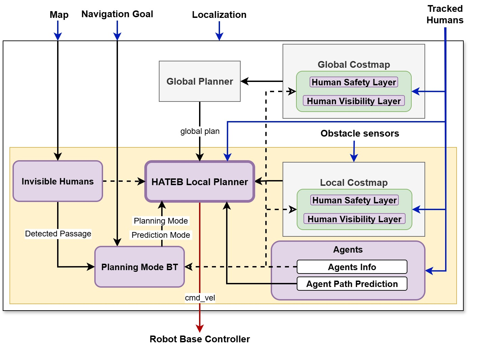
  </a>
</p>

### Social Constraints Illustrated

<table>
  <tr>
    <td>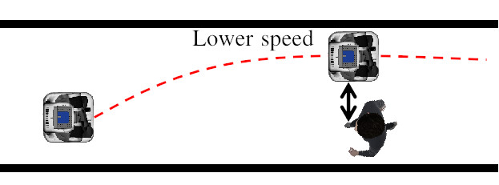</td>
    <td>&nbsp;&nbsp;&nbsp;</td>
    <td>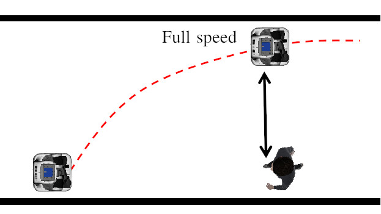</td>
  </tr>
</table>

---
<table>
  <tr>
    <td>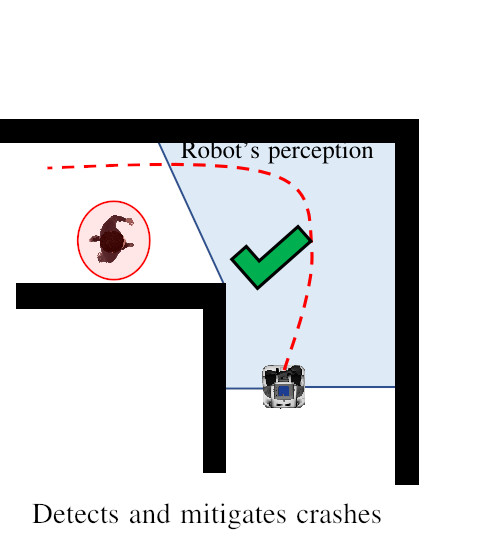</td>
    <td>&nbsp;&nbsp;&nbsp;</td>
    <td>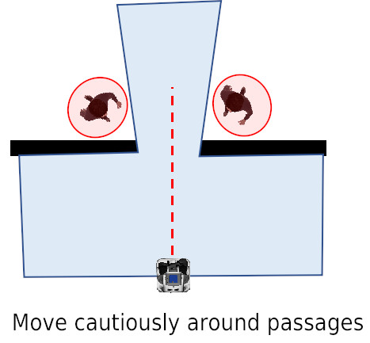</td>
  </tr>
</table>

---
<table>
  <tr>
    <td>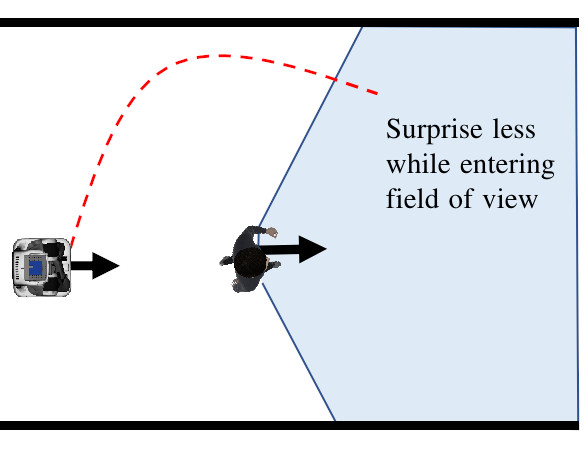</td>
    <td>&nbsp;&nbsp;&nbsp;</td>
    <td>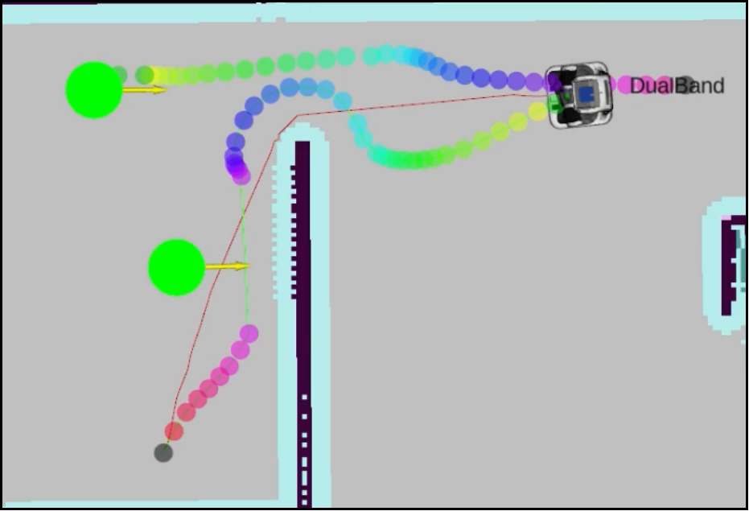</td>
  </tr>
</table>

### Configuration Guide

- #### Planning Mode
        planning_mode: 1 #(0: robot navigation wuth no human planning. 1: human-aware planning)

- #### Robot Params
        robot:  
            max_vel_x: 0.7  
            max_vel_x_backwards: 0.4  
            max_vel_theta: 1.2  
            min_vel_theta: 0.1  
            acc_lim_x: 0.3  
            acc_lim_theta: 0.4  

- #### Agent Model Params
        agent:  
            agent_radius: 0.30  
            max_agent_vel_x: 1.3  
            max_agent_vel_y: 0.4  
            max_agent_vel_x_backwards: 0.01  
            max_agent_vel_theta: 1.1  
            agent_acc_lim_x: 0.6  
            agent_acc_lim_y: 0.3  
            agent_acc_lim_theta: 0.8  

- #### HATEB Params (activate all constraints and set thresholds (these are defaults for good performance))
        hateb:  
            use_agent_agent_safety_c: True    
            use_agent_robot_safety_c: True  
            use_agent_robot_rel_vel_c: True  
            use_agent_robot_visi_c: True  
            add_invisible_humans: True  
            min_agent_agent_dist: 0.4  
            min_agent_robot_dist: 0.8  
            rel_vel_cost_threshold: 1.5  
            visibility_cost_threshold: 2.5  
            invisible_human_threshold: 1.0  
            prediction_time_horizon: 10.0  

- #### Optimization weights 
        optim:
            weight_agent_robot_safety: 5.0  
            weight_agent_agent_safety: 2.0  
            weight_agent_robot_rel_vel: 5.0  
            weight_agent_robot_visibility: 5.0  
            weight_invisible_human: 1.0  
            weight_kinematics_nh: 1000. ## 0 for Omni, 1000 for diff  
            weight_kinematics_forward_drive: 50.0  

All parameters here: https://github.com/sphanit/CoHAN-Nav2/blob/main/src/cohan_nav2_tutorial/config/nav2_params.yaml

### Example run in simulation
We will use the Docker shell to build and run the example.

```
cd socnav_ws/CoHAN-Nav2
./install-deps.sh
./compile.sh
source install/setup.bash
ros2 launch cohan_nav2_tutorial cohan_nav2_launch.py
```

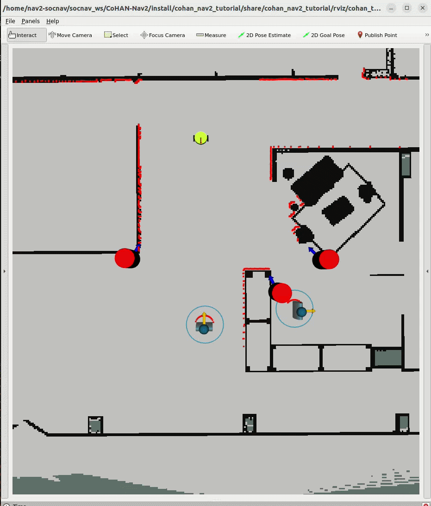